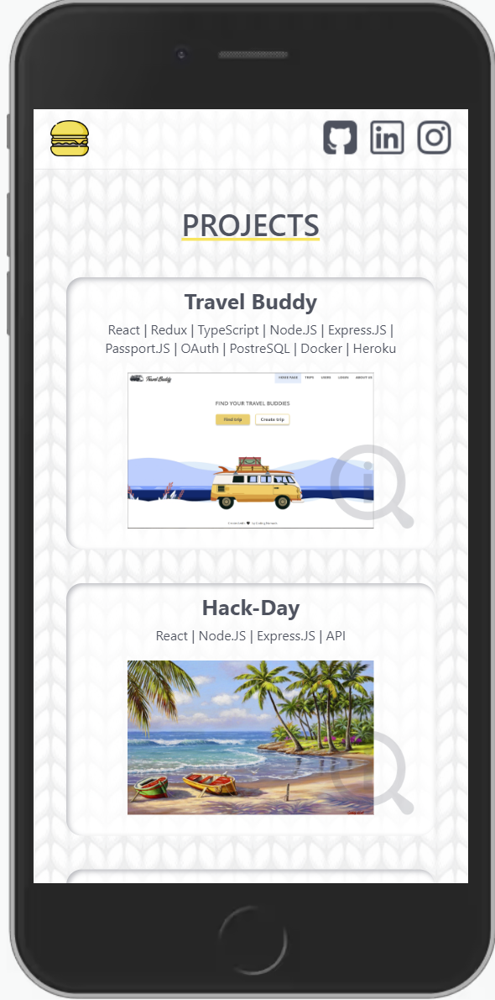
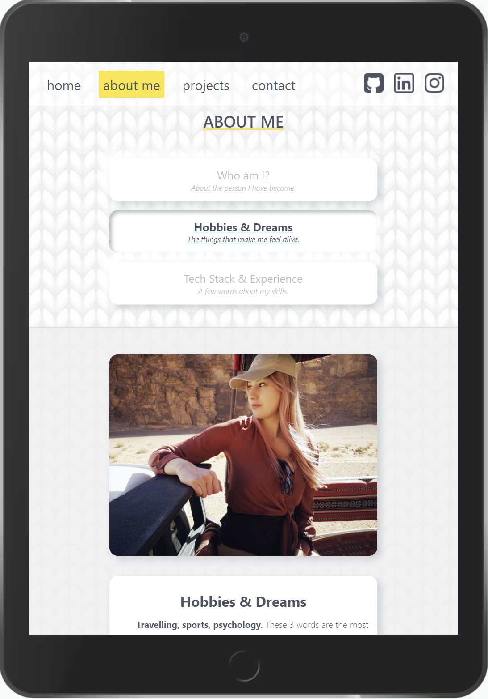
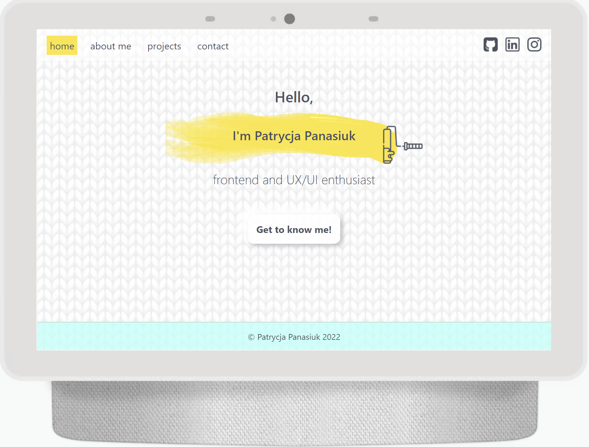

# portfolio22
You can see the live website [_HERE._](https://patrycja.info/)

## Table of Contents
* [General Info](#general-information)
* [Technologies Used](#technologies-used)
* [Screenshots](#screenshots)

## General Information
### Context
Personal website project that enables contact with developer, shows portfolio and 'about me' section.

## Technologies Used
### Front-end
- TypeScript
- React
- Next.js

### Back-end
- Herotofu (Forms Backend with built-in Encryption)

### Deployment and hosting
- OVH hosting
- GitHub actions for CI/CD pipeline

## Screenshots

